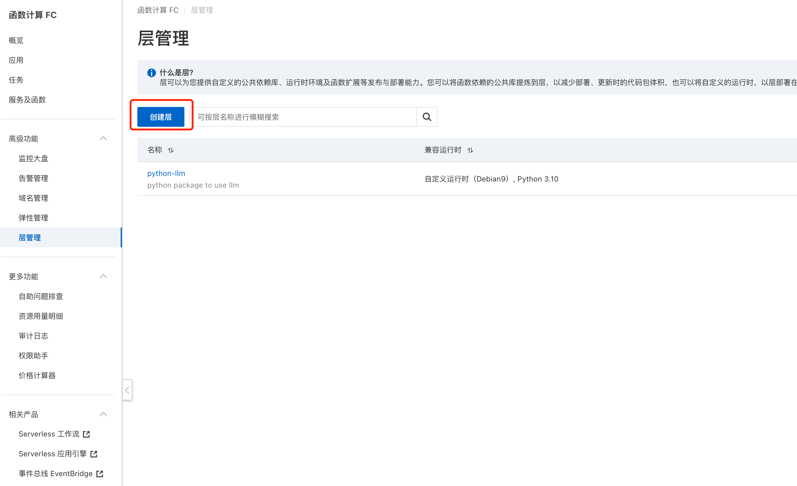

# AI Service

通用AI Service，支持通用AI任务，目前支持：

- 文章摘要

# 部署方法

1. 根据指导安装serverless-devs并配置阿里云密钥：https://docs.serverless-devs.com/serverless-devs/quick_start
2. 通过阿里云函数部署，在阿里云函数中使用requirements.txt创建自定义层，替换掉`s.yaml`中的python package
    

3. 更改环境变量：
   - `LLM_HOST`: AI服务器，如果不配置默认是: https://api.openai.com/v1
   - `LLM_TOKENS`: api_token
   - `LLM_TYPE`: openai # 暂时只支持openai
   - `BASIC_TOKEN`: "用户名:密码"base64编码后的字符串，存在Authorization中，用于认证，建议通过https访问。因为一般这个AI服务不会直接暴露给用户，所以采用最简单的认证也可以。
   - `ENV`: dev, test, prod

4. 在项目目录运行`s deploy`即可

# 接口

在dev环境，通过`127.0.0.1:9000/docs`访问